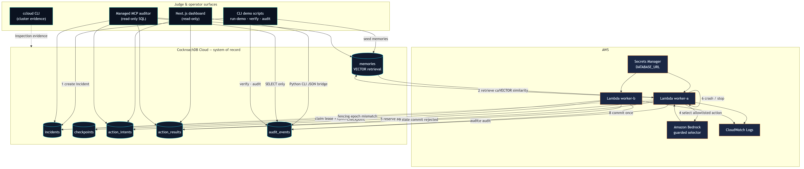

# RelayGuard


**Crash-safe memory for incident-response agents** — resume after failures, reject unsafe precedent, and keep one committed remediation action in RelayGuard's CockroachDB action ledger.


## Submission links


| Link | URL |

|------|-----|

| **GitHub** | https://github.com/prabhakaran-jm/relayguard *(public)* |

| **Demo app** | https://relayguard-production.up.railway.app — live judge dashboard (Railway); local: [`scripts/run-web.ps1`](scripts/run-web.ps1) |

| **Demo video** | `https://youtu.be/YOUR_VIDEO_ID` *(replace before Devpost submit)* |

| **Devpost** | `https://devpost.com/software/relayguard` *(replace with final project URL)* |


## Problem


Autonomous incident agents crash, retrieve misleadingly similar memories, and retry duplicate fixes. Without durable coordination, stale workers can commit late and operators cannot prove what happened.


## What RelayGuard does


RelayGuard sits between agents and the systems they act on:


1. **Retrieve** semantically similar runbooks and outcomes (CockroachDB VECTOR)

2. **Classify** memories with MemoryGate (`USE` / `INSPECT` / `AVOID`)

3. **Select** an allowlisted remediation via guarded selector (mock or Amazon Bedrock)

4. **Reserve** actions in an idempotent ledger with lease fencing

5. **Resume** from checkpoints after crash or failover

6. **Audit** every claim, block, reservation, commit, and rejection


The demo: Worker A reserves `ROUTE_TO_STANDBY` and crashes → Worker B records **one committed remediation action** in the ledger → Worker A's stale commit is rejected → **Invariants PASS**.


## Why CockroachDB is central


CockroachDB Cloud is the **system of record** for all agent memory and coordination:


| Concern | CockroachDB role |

|---------|------------------|

| Semantic memory | `memories` + VECTOR index |

| Execution memory | `checkpoints`, `incidents` (lease + epoch) |

| Outcome memory | `action_intents`, `action_results` |

| Audit memory | `audit_events` |


Survivable state, fencing tokens, and serializable updates make crash recovery provable — not best-effort. RelayGuard prevents duplicate committed actions **inside its ledger**; stale workers cannot commit after losing the fencing epoch.


## Demo flow


```

create incident → seed memories → Worker A: retrieve → MemoryGate → select → reserve → crash

→ lease expiry → Worker B: claim → resume → one ledger commit → Worker A stale commit rejected

→ verify PASS → audit PASS → dashboard

```


## Quick start (local)


```powershell

python -m venv .venv

.\.venv\Scripts\Activate.ps1

pip install -e ".[dev]"

copy .env.example .env


docker compose -f infra/docker-compose.yml up -d

.\scripts\run-demo.ps1

```


```bash

python -m venv .venv && source .venv/bin/activate

pip install -e ".[dev]"

cp .env.example .env

bash scripts/run-demo.sh

```


## Run against CockroachDB Cloud


```bash

RELAYGUARD_DB_TARGET=cloud

DATABASE_URL_CLOUD=postgresql://...

COCKROACH_VECTOR_MODE=auto

```


```bash

python -m apps.cli.db_status          # proves VECTOR mode, no credentials

.\scripts\run-demo.ps1

.\scripts\capture-evidence.ps1

```


Guides: [`docs/cockroach-cloud.md`](docs/cockroach-cloud.md), [`docs/ccloud.md`](docs/ccloud.md)


## Run AWS Lambda demo


```powershell

.\infra\aws\scripts\deploy-lambda.ps1 -DatabaseSecretArn "arn:..." -DatabaseSecretName "relayguard/db"

$env:RELAYGUARD_LAMBDA_FUNCTION_NAME = "relayguard-worker"

.\infra\aws\scripts\invoke-demo.ps1

```


Guide: [`docs/aws-lambda.md`](docs/aws-lambda.md) · Evidence: [`docs/evidence/`](docs/evidence/)


## Open dashboard


```powershell

.\scripts\run-web.ps1

# http://localhost:3000

```


Read-only judge UI — proof cards, MemoryGate verdicts, story-ordered timeline, action ledger. Guide: [`docs/frontend.md`](docs/frontend.md)


## Hackathon tool map


| Sponsor | Tool | Proof in RelayGuard |

|---------|------|---------------------|

| **CockroachDB** | Cloud | System of record — incidents, memories, checkpoints, ledger, audit |

| **CockroachDB** | Distributed Vector Indexing | `VECTOR(64)` retrieval + MemoryGate verdicts |

| **CockroachDB** | Managed MCP | Read-only audit — [`docs/mcp-auditor.md`](docs/mcp-auditor.md) · [`mcp_worker_rejection_answer.png`](docs/evidence/mcp_worker_rejection_answer.png) |

| **CockroachDB** | ccloud CLI | [`infra/ccloud/check-cluster.*`](infra/ccloud/) · [`docs/evidence/m8_ccloud_check.txt`](docs/evidence/m8_ccloud_check.txt) |

| **AWS** | Lambda | Regional workers — live handoff demo |

| **AWS** | Secrets Manager | `DATABASE_URL` for Lambda (`relayguard/db`) |

| **AWS** | CloudWatch | Worker logs — [`docs/evidence/m6_cloudwatch_logs.png`](docs/evidence/m6_cloudwatch_logs.png) |

| **AWS** | Bedrock | Guarded selector — `ACTION_SELECTOR=bedrock`, [`scripts/run-bedrock-demo.ps1`](scripts/run-bedrock-demo.ps1) |


## Architecture





Full diagram: [`docs/architecture-diagram.md`](docs/architecture-diagram.md) · PNG · SVG


## Testing


```powershell

.\scripts\test.ps1 -v

```


```bash

.venv/bin/python -m pytest -v

```


**66/66** tests — integration tests use Docker CockroachDB locally.


## Evidence


Captured proof for judges: [`docs/evidence/README.md`](docs/evidence/README.md)


```powershell

.\scripts\capture-evidence.ps1

```


| Asset | Link |

|-------|------|

| Evidence index | [`docs/evidence/README.md`](docs/evidence/README.md) |

| MCP proof | [`mcp_worker_rejection_question.png`](docs/evidence/mcp_worker_rejection_question.png) · [`mcp_worker_rejection_answer.png`](docs/evidence/mcp_worker_rejection_answer.png) |
| Architecture | [`architecture-diagram.png`](docs/architecture-diagram.png) |

## Known limits


- Bedrock selector optional — mock default for CI and Lambda demo; live Bedrock via `run-bedrock-demo`

- RelayGuard coordinates remediation in its ledger — it does not guarantee single execution on external systems outside that path

- Managed MCP used read-only in demo; production MCP wiring documented in [`docs/mcp-auditor.md`](docs/mcp-auditor.md)

- Local Docker uses `FLOAT8[]` fallback; Cloud uses native VECTOR

- Dashboard is read-only; no auth, no incident editing

- Single-region Lambda deployment for hackathon scope


## Future work


- Production Managed MCP auditor tools

- Real incident source integrations

- Multi-region Lambda + richer Bedrock policies

- Human approval workflow for `INSPECT` memories

- Agent Skills packaging for MemoryGate diagnostics


## Project layout


```

apps/cli/       CLI entry points

apps/web/       Next.js judge dashboard

relayguard/     Core library

workers/        MemoryGate, retriever, worker runtime

db/             CockroachDB schema

infra/          Docker, ccloud, AWS Lambda/Terraform

scripts/        Demo, evidence, dashboard runners

docs/           Architecture, evidence, submission assets

tests/          Pytest suite

```


## License


[MIT License](LICENSE) — visible in repository root.


