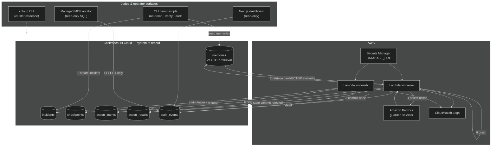

# RelayGuard architecture diagram

Judge-facing view of how RelayGuard uses CockroachDB Cloud and AWS.

## Diagram



Source: [`architecture-diagram.mmd`](./architecture-diagram.mmd)

Exported images:

- [`architecture-diagram.png`](./architecture-diagram.png)
- [`architecture-diagram.svg`](./architecture-diagram.svg)

Regenerate:

```bash
npx @mermaid-js/mermaid-cli -i docs/architecture-diagram.mmd -o docs/architecture-diagram.png -b transparent
npx @mermaid-js/mermaid-cli -i docs/architecture-diagram.mmd -o docs/architecture-diagram.svg
```

## Demo story (10 steps)

| Step | What happens | Proof |
|------|----------------|-------|
| 1 | Incident created | `incidents`, `audit_events: incident.created` |
| 2 | Worker A retrieves memory | `memories` VECTOR search, `memory.retrieved` |
| 3 | MemoryGate blocks unsafe memories | `memory.classified` with `AVOID` |
| 4 | Bedrock/mock selector picks allowlisted action | `action.selected` |
| 5 | Worker A reserves action | `action_intents`, `action_intent.reserved` |
| 6 | Worker A stops (simulated crash) | checkpoint at `ACTION_RESERVED` |
| 7 | Worker B resumes from CockroachDB | `lease.claimed` higher epoch, checkpoint read |
| 8 | Worker B commits once | single `action_results` row |
| 9 | Worker A stale commit rejected | `action.commit_rejected` |
| 10 | Dashboard and MCP read audit trail | `audit_incident`, Next.js dashboard |

## Design rules

- **Writes** go through RelayGuard workers only (CLI or Lambda).
- **Dashboard and MCP** are read-only — no direct mutation of incident state.
- **Bedrock** proposes actions; RelayGuard validates, records, and commits.
- **ccloud** is operator evidence only — not invoked by workers or models.
